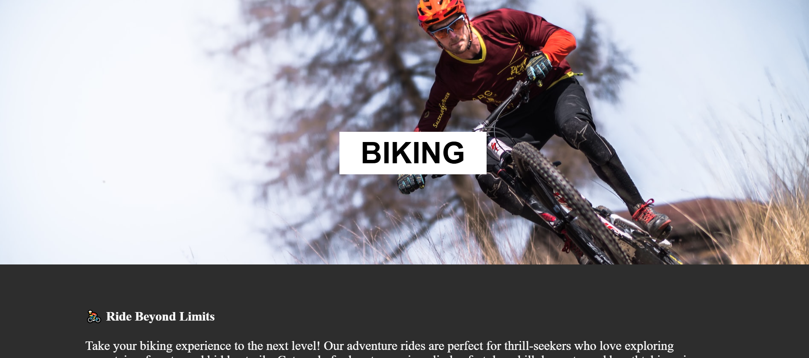

# 🌄 Parallax Adventure Website

## 📌 Project Description

A modern, responsive parallax scrolling website built using HTML, CSS, and JavaScript. It showcases layered scrolling effects, smooth animations, and interactive UI elements like a scroll progress bar and dark mode toggle.

---

## 🔗 Live Demo

👉 https://mdezajansari.github.io/Parallex-website/

---

## 📸 Screenshots

### 🖥️ Hero Section


### 📱 Responsive View




---

## 🚀 Features

* 🌌 Parallax scrolling effect
* 📱 Fully responsive design
* 🎨 Modern UI with overlay and typography
* 📊 Scroll progress indicator
* 🌙 Dark mode toggle
* ⚡ Smooth scrolling

---

## 🛠️ Tech Stack

* **HTML5**
* **CSS3**
* **JavaScript (Vanilla)**

---

## 📂 Project Structure

```
parallax-project/
│── index.html
│── style.css
│── script.js
│── assets/
```

---

## ⚙️ How to Run Locally

1. Clone the repository:

   ```
   git clone https://github.com/your-username/parallax-project.git
   ```

2. Navigate to the project folder:

   ```
   cd parallax-project
   ```

3. Open `index.html` in your browser.

---

## 🎯 Learning Outcomes

* Understanding CSS perspective and transforms
* Implementing parallax scrolling
* Creating responsive layouts
* Adding scroll-based animations

---

## 🔮 Future Improvements

* Add mouse-based parallax effect
* Integrate animation libraries (GSAP / Framer Motion)
* Convert into React project
* Add multiple pages

---

## 👨‍💻 Author

**Md Ezaj**

